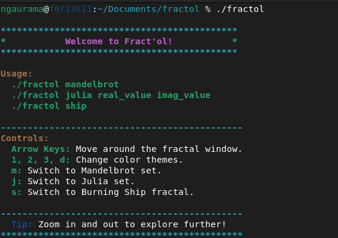
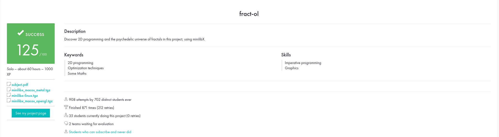

# fract'ol
A computer graphics project to render fractals in real time, developed as part of the 42 Common Core curriculum.
The project demonstrates interactive visualization of Julia, Mandelbrot and Burning Ship fractals using the MiniLibX graphics library.

---

## Features
### Mandatory
Fractals supported:
+ Mandelbrot set
+ Julia set (with customizable parameters)
+ Burning Ship set
### Interactive controls:
+ Zoom in/out using the mouse wheel
+ Close the window with ESC or the window’s close button
+ Use arrow keys to move around the factals
+ Change fractals with keys m, j, and s (for Mandelbrot, Julia, and Ship respectively)
+ Left click when on Julia fractal to view pre-valued cool Julia sets
+ Use 1, 2, 3, and d (default) for different types of color options
### Rendering:
+ Smooth window management (dynamic window resizing is not possible with minilibx)
+ Multiple colors to reveal depth, allowing psychedelic effects

---

## Project Structure

```
├── fractols/                 # All Fractals files
├── fractal.c                 # Main File
├── herlpers/                 # All helpers such as event controls, colors and so on
├── Makefile
└── README.md

```
---

## Installation

### Clone and build
```bash
git clone https://github.com/ngaurama/fractol.git
cd fractol
make
```

▶ Usage

```
./fractol <fractal_name> or <without paramaters for more info>
```


---

### Learning Outcomes

Through this project, I gained experience with:
+ Using MiniLibX for graphics and window management in C
+ Rendering complex mathematical sets
+ Handling user input events (keyboard and mouse) in real time
+ Implementing smooth zooming and panning for fractals
+ Managing colors dynamically to visualize fractal depth and patterns
+ Structuring a modular C program with separate responsibilities
---
## Evaluation

---
## Author
+ Nitai Gauramani
  - 42 Paris – Common Core project <br>


